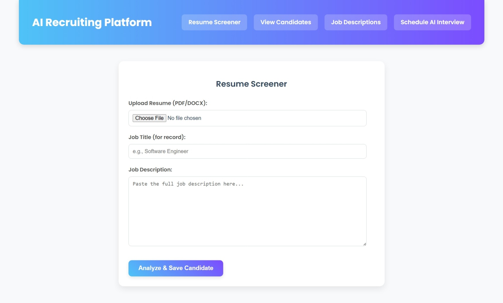
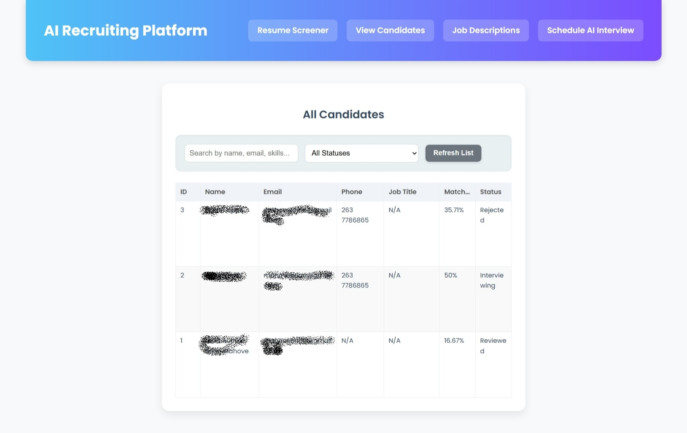
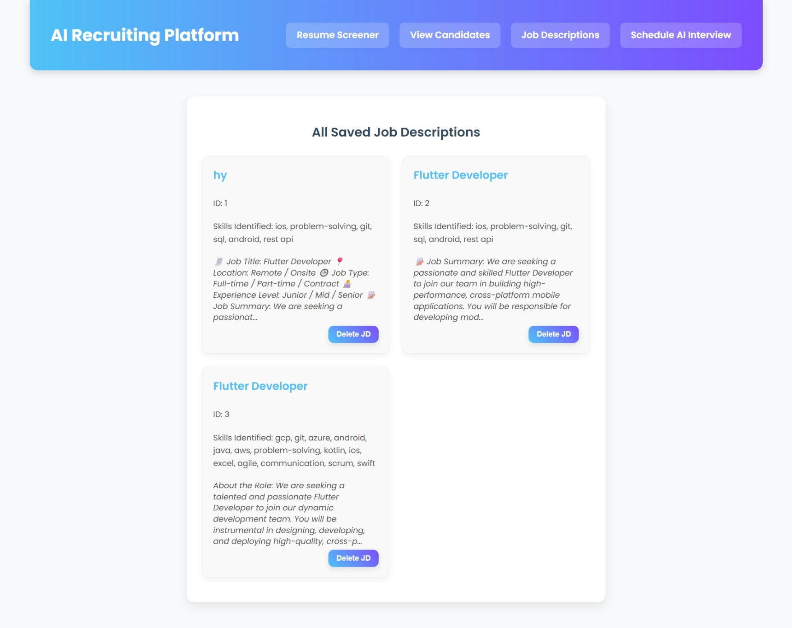
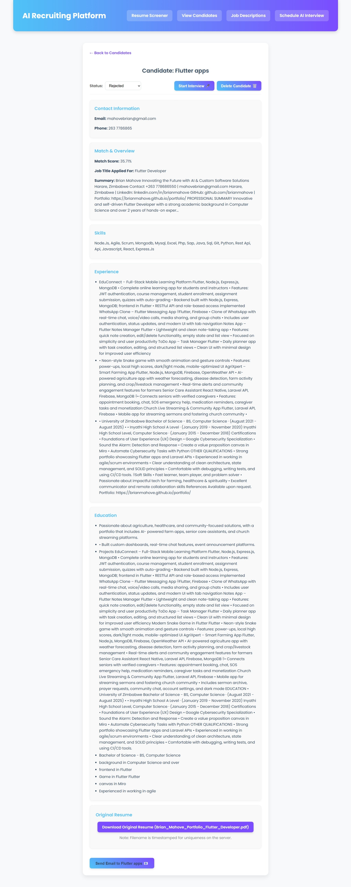
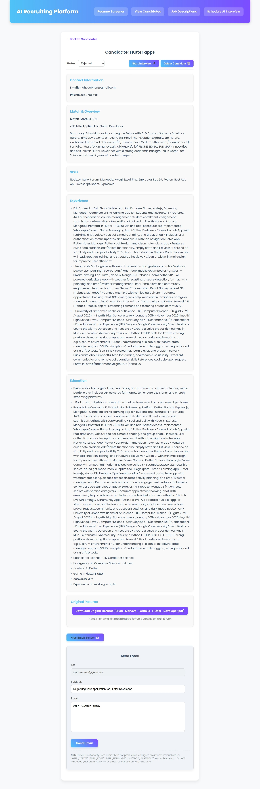

# 🔍 AI Recruiting Platform – Smarter Hiring Starts Here

📣 I'm excited to finally showcase a project I've been building: an **AI-Powered Recruiting Platform** designed to help teams hire smarter, faster, and more fairly.

This full-stack web application uses **React** on the frontend and **Flask (Python)** on the backend, leveraging **AI and automation** to streamline key recruitment workflows.

---

## 🧠 Key Features

### 📄 1. Intelligent Resume Screening

AI automatically parses resumes and job descriptions, then generates a **match score** to help recruiters quickly identify the most suitable candidates.

---

### 👥 2. Candidate Pipeline Management

Track each candidate’s progress from application to hire. View detailed candidate profiles, update status, and manage everything in one clean dashboard.

---

### 📝 3. Job Description Hub

Store and manage all your job descriptions in one place. Easily reuse or edit job templates and sync them with open positions.

---

### 📅 4. Automated Interview Scheduling

Eliminate back-and-forth emails! Recruiters can schedule interviews directly through the platform based on calendar availability.

---

### 🤖 5. AI Chatbot Interviewer

Our AI assistant conducts first-round screenings with predefined questions, saving recruiters time and ensuring **unbiased, consistent assessments**.

---

## 🚀 Why I Built This

Hiring is broken — it’s time-consuming, biased, and inefficient. My goal was to build a **modern solution** using AI and automation to:

- ✅ Save time for hiring teams  
- ✅ Improve candidate experience  
- ✅ Enhance decision-making with data  
- ✅ Promote fairness and consistency in hiring

---

## ⚙️ Tech Stack

- **Frontend:** React.js + TailwindCSS  
- **Backend:** Python (Flask) + REST APIs  
- **Database:** PostgreSQL  
- **AI/ML:** NLP for resume parsing + similarity matching  
- **Others:** Socket.IO, NLTK, Pandas, Eventlet

---

## 💬 Let’s Collaborate!

I’m always open to feedback, ideas, or collaborations. If you’re working in **HRTech**, **AI**, or **product development**, let’s connect!

**How do *you* see AI shaping the future of recruitment?**

---

## 📌 Hashtags

#AIRecruiting #HRTech #SoftwareEngineering #Flask #ReactJS #ArtificialIntelligence  
#MachineLearning #HiringTech #Recruitment #Innovation #TechForGood
